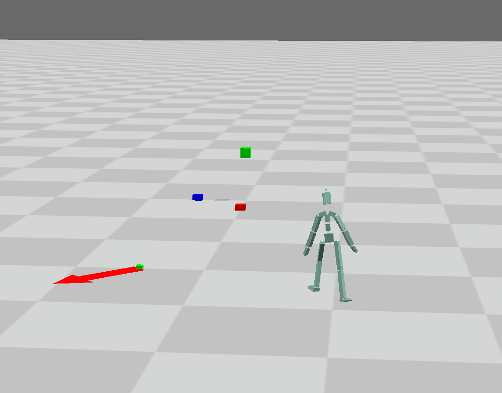
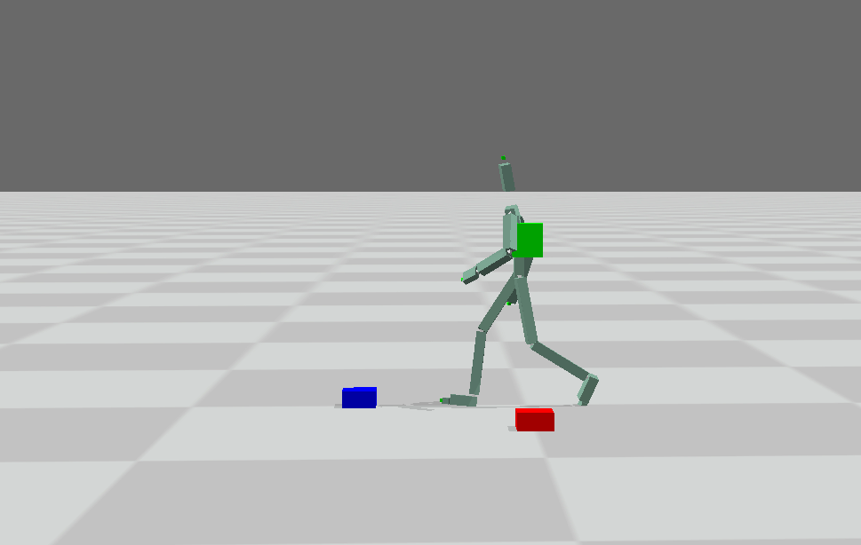
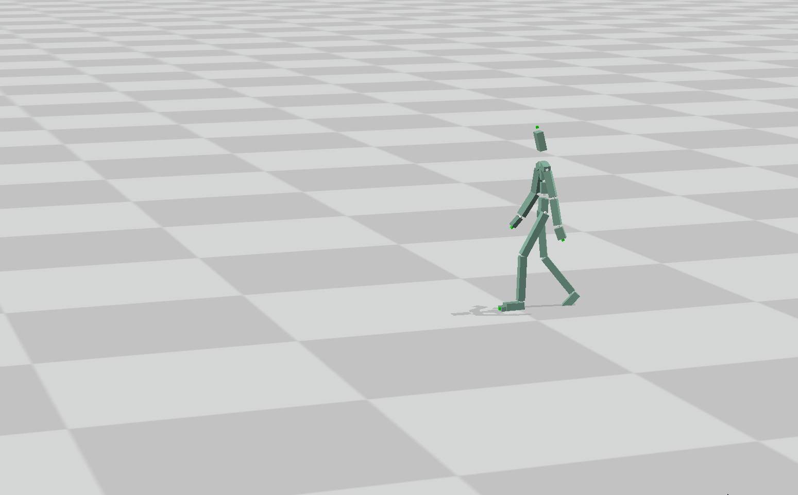
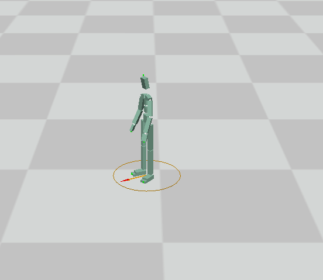

# GAMES 105 

https://games-105.github.io/

GitHub: https://github.com/BanMing/GAMES-105

## Lab1

A Pose

 

inverse kinematics before

 

inverse kinematics after

 

inverse kinematics animation

 

 

## Lab2

 

blend two motions

concatenate two motions

motion matching

